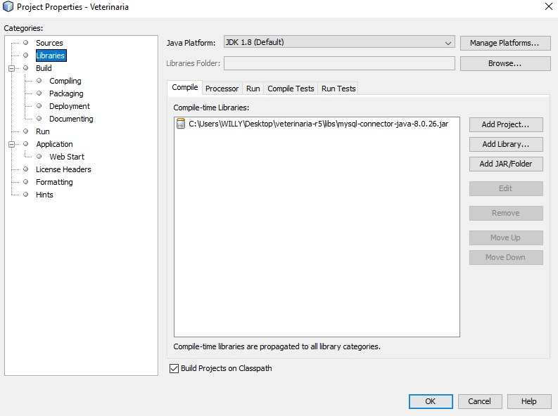

# Reto 5 - Veterinaria
Proyecto final del ciclo 2 sobre MVC y bases de datos del programa Misión TIC 2022 de la Universidad Nacional de Colombia.

## Configuración del proyecto
Para usar el código generado en este repositorio, debe seguir los siguientes pasos:

1. Crear un nuevo proyecto Java con Netbeans.
2. Luego de que el proyecto se haya cargado, de click derecho en el nombre del proyecto recién creado y seleccione properties.
    
3. En la ventana que aparece, seleccione la carpeta src, clic en **remove**, luego de clic en **Add Folder** y busque la carpeta src de este repositorio. Repita este proceso con test. Debería tener algo similar a esto:
    
4. Para el caso de este proyecto, es necesario importar la librería para conectarse a la base de datos de MySQL (Puede descargarla [aquí](./libs)). Para ello, en la ventana properties (del paso anterior) diríjase a **Libraries** y en la pestaña **Compile** de clic en **Add JAR/Folder** para buscar la librería de MySQL y adicionarla al proyecto.
    
5. Siga el mismo proceso anterior para importar las librerías JUnit y Hamcrest, para utilizarlas en las pruebas del proyecto.
    
6. Luego de haber realizado lo anterior, de clic en **Ok** para guardar los cambios.
7. Ahora con la información del proyecto cargado, diríjase a la carpeta **utils** y cree un archivo `dbCredentials.java` donde incluirá las credenciales a la base de datos con el siguiente formato.
    ```java
    public final String ip = "su ip de acceso"; // Si es un base de datos local, por defecto es 127.0.0.1
    public final String accessPort = "su puerto"; // Por defecto es 3306
    public final String user = "Su usuario de acceso a la base de datos"; 
    public final String pass = "Su contraseña de acceso a la base de datos";
    ```
    En [dbCredentialsExample.java](./src/utils/dbCredentialsExample.java) también puede encontrar este fragmento de código. 
8. Por último, cree las bases de datos con las que trabaja este proyecto la [principal](./src/utils/dbCreation.sql) y la de [pruebas](./test/utils/dbTestCreation.sql). Si tiene MySQL Workbench, puede abrir los scripts y ejecutarlos. También puede copiar su contenido y ejecutar las consultas desde consola.

